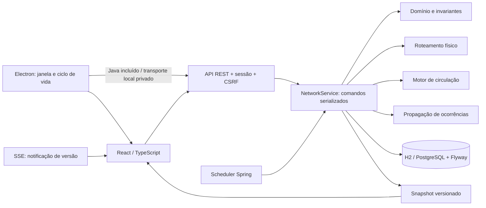

# Ferrovia · Centro de Operações

Aplicativo de supervisão e simulação ferroviária para **Windows**, com janela própria, instalador e interface em português. A referência inicial contém **13 linhas históricas de São Paulo, 173 estações e 26 composições identificadas**. A mesma aplicação também pode ser executada como servidor web.

**Stack:** Electron 44 · Java 21 · Spring Boot 4.1.1 · React 19.3 · TypeScript 7 · Vite 8 · H2/PostgreSQL · Flyway.

O desktop inicia e encerra o motor automaticamente. Seus dados ficam na conta do Windows e o Java necessário acompanha o instalador. Não é necessário abrir navegador ou terminal para usar o aplicativo instalado.

## Conteúdo

- [Instalar e abrir o aplicativo](#instalar-e-abrir-o-aplicativo)
- [Menus, dados e atualizações](#menus-dados-e-atualizações)
- [Executar como servidor web](#executar-como-servidor-web)
- [Operação pelo painel](#operação-pelo-painel)
- [Tutorial de uso](#tutorial-de-uso)
- [Modelo da rede](#modelo-da-rede)
- [Segurança e persistência](#segurança-e-persistência)
- [Configuração do ambiente](#configuração-do-ambiente)
- [API](#api)
- [Desenvolvimento e testes](#desenvolvimento-e-testes)
- [Solução de problemas](#solução-de-problemas)
- [Referência e limites](#referência-e-limites)

## Instalar e abrir o aplicativo

Requisito de uso: **Windows 10/11 x64**. O pacote já contém Electron, a interface, o motor e Eclipse Temurin Java 21. Internet é necessária para obter o instalador; a simulação funciona offline depois de instalada. Links de referência externos dependem de conexão.

1. Abra `Ferrovia-Setup-1.0.0-x64.exe`, gerado em `desktop/release/`.
2. Escolha a pasta de instalação e conclua o assistente. A instalação é para a sua conta e cria atalhos no menu Iniciar e na área de trabalho.
3. Abra **Ferrovia** pelo atalho. Aguarde a tela **Preparando sua rede**.
4. O painel abre como **Aplicativo local**, com acesso à operação e à infraestrutura. O desktop usa a conta do Windows; não pede usuário/senha da versão web.
5. Confira as 26 composições iniciais e siga o [tutorial de uso](#tutorial-de-uso). Se houver um cenário salvo, ele será recuperado.
6. Para encerrar, feche a janela ou use **Arquivo → Sair**. O motor pausa a simulação, salva o estado confirmado e encerra junto.

O instalador desta versão ainda não possui assinatura digital de editor. Para distribuir uma versão assinada, configure o certificado no processo de release. Não há atualização automática.

### Gerar o instalador a partir do código

Para desenvolver/compilar, use **Windows x64, JDK 21 e Node.js 22.12+**. Os downloads iniciais acessam npm, Maven Central, GitHub/Adoptium e os componentes de empacotamento do Electron. Não é necessário instalar Rust, Maven ou NSIS globalmente.

```powershell
$env:JAVA_HOME = 'C:\Program Files\Java\jdk-21.0.11' # ajuste para seu JDK 21
.\scripts\build-desktop.ps1
.\scripts\run-desktop.ps1
```

O build compila a interface e o backend, executa os testes, obtém o Java redistribuível com **SHA-256 fixado** e gera:

| Artefato | Uso |
| --- | --- |
| `desktop/release/Ferrovia-Setup-1.0.0-x64.exe` | Instalador para o usuário final |
| `desktop/release/Ferrovia-Setup-1.0.0-x64.exe.sha256` | Checksum do instalador |
| `desktop/release/win-unpacked/Ferrovia.exe` | Executar sem instalar, mantendo toda a pasta `win-unpacked` ao lado |
| `desktop/resources/` | Java, JAR e manual preparados para desenvolvimento |

`scripts/run-desktop.ps1` abre o executável já gerado. Para atualizar somente o inicializador depois de um build completo, use `scripts/build-desktop.ps1 -SkipCoreBuild`; essa opção reutiliza o JAR existente e não incorpora mudanças posteriores do backend/frontend. Binários e dependências não são versionados no Git.

## Menus, dados e atualizações

| Menu / atalho | Operação |
| --- | --- |
| **Arquivo → Exportar cenário** / `Ctrl+Shift+S` | Escolher onde salvar um JSON consistente da rede |
| **Arquivo → Abrir pasta de dados** | Abrir a pasta do banco H2 |
| **Arquivo → Abrir registros** | Consultar `engine.log` para diagnóstico |
| **Exibir** | Recarregar o painel, alterar zoom ou entrar em tela cheia |
| **Ajuda → Manual de uso** | Abrir uma cópia offline deste README |
| **Arquivo → Sair** / `Alt+F4` | Encerrar a janela e o motor |

Os dados do desktop são guardados em `%APPDATA%\Ferrovia`. Para abrir essa pasta manualmente, pressione `Win+R`, digite o caminho e confirme:

- `data\ferrovia.mv.db`: cenário persistido e auditoria.
- `logs\engine.log`: registro de inicialização, operação e encerramento. Ao ultrapassar 5 MB, ele é rotacionado na próxima abertura para `engine.previous.log`.
- Outros arquivos nessa pasta pertencem ao ambiente da janela do aplicativo.

Somente uma instância abre por conta do Windows. Um segundo clique no ícone traz a janela existente à frente. Contas diferentes têm cenários separados. O modo desktop é local e administrativo; para vários operadores, autenticação individual e banco central, use a implantação web.

**Backup e migração:** exporte em **Arquivo → Exportar cenário** ou **Infraestrutura → Exportar JSON**. Para levar dados da versão web ao aplicativo, exporte no navegador e use **Infraestrutura → Importar JSON** no desktop. A importação substitui a rede atual após confirmação e validação. O JSON transfere o cenário; não transfere contas nem o histórico de auditoria anterior. Para backup completo, feche o aplicativo e copie a pasta `data`.

**Atualizar:** feche o aplicativo, faça backup e execute o novo instalador. Instalação e desinstalação preservam `%APPDATA%\Ferrovia`; desinstalar não apaga seu cenário. **Restaurar referência**, na aba Infraestrutura, substitui o cenário atual pela base inicial mediante confirmação.

## Executar como servidor web

Requisitos: **JDK 21**, **Node.js 22.12 ou superior** e acesso ao Maven Central/npm na primeira compilação. Maven é obtido pelo wrapper com checksum SHA-256 fixado. Não é necessário instalar Maven globalmente.

No PowerShell, a partir da raiz do projeto:

```powershell
# Ajuste o caminho para seu JDK 21, se necessário.
$env:JAVA_HOME = 'C:\Program Files\Java\jdk-21.0.11'
.\scripts\build.ps1
.\scripts\run.ps1
```

Abra **http://127.0.0.1:8080**. O usuário local é `admin`. Se `RAIL_ADMIN_PASSWORD` não estiver definido, o servidor gera uma senha temporária e a apresenta no terminal a cada inicialização. Não há senha padrão no código.

Para manter as credenciais entre reinícios, configure as variáveis `RAIL_ADMIN_PASSWORD`, `RAIL_OPERATOR_PASSWORD` e `RAIL_VIEWER_PASSWORD` no ambiente antes de iniciar. As contas `operator` e `viewer` só existem quando suas senhas são definidas. Senhas: mínimo de 12 caracteres, máximo de 72 bytes UTF-8.

No Linux/macOS:

```bash
bash scripts/build.sh
java -jar target/ProjetoCPTM-1.0.0-SNAPSHOT.jar
```

O JAR contém a interface compilada. A aplicação escuta apenas em `127.0.0.1` por padrão. Os dados ficam em `data/ferrovia.mv.db`, ignorado pelo Git.

## Operação pelo painel

- **Mapa da rede:** filtre uma linha, amplie ou arraste o mapa, selecione uma estação ou uma composição pelo número. O painel mostra posição, linha atual/designada, velocidade, perfil, capacidade e espera acumulada.
- **Circulação:** inicie, pause, altere a escala de tempo ou avance dez segundos com a simulação pausada. Cada trem percorre os trechos direcionais da sua linha e retorna nos terminais.
- **Frota:** crie composições, escolha a plataforma/sentido e o perfil técnico. Entrada em plataforma ocupada, identificação repetida ou perfil incompatível é recusada. Edição/exclusão exige trem fora de circulação; retirada exige chegada à plataforma.
- **Transferência:** selecione uma composição em plataforma e clique em **Planejar transferência**. A simulação é pausada para calcular e revisar a rota. Autorize e clique em **Iniciar** para executar. A linha designada muda na chegada ao destino. A rota é reavaliada em plataforma se houver bloqueio. Cancele em uma plataforma para retomar a circulação na linha atual.
- **Ocorrências:** informe rótulo, severidade, categoria, local e efeito (aviso, redução a até 15 km/h ou bloqueio). Reconhecer um alerta não remove seu efeito. Resolver uma ocorrência preserva as demais. São exibidos origem e caminho de propagação por linha.
- **Infraestrutura (admin):** pause e cadastre/edite linhas, estações, plataformas, perfis, vias e dependências. Não é possível excluir itens referenciados nem deslocar a geometria de uma via ocupada ou com rota em uso. As coordenadas são esquemáticas.
- **Cenários (admin):** exporte o estado como JSON, importe um cenário validado de até 5 MB ou restaure a referência inicial. Importação/restauração substitui a rede atual, preserva a auditoria e deixa o relógio pausado.
- **Histórico:** consulte os últimos 200 comandos, operador, instante e versão. A tabela de auditoria mantém todos os comandos; a API limita a consulta. Estatísticas usam a espera acumulada dos trens ativos, não atraso em relação a uma grade horária.

### Demonstração da transferência entre linhas

No cenário inicial, selecione a composição **0701 (`L7-T1`)**, na Luz, e planeje destino **10 · Turquesa**. O caminho usa a ligação histórica do Serviço 710. Inicie a simulação após autorizar. Uma tentativa da Linha 1 para a Linha 2 é recusada: a integração de passageiros não é uma via de transferência cadastrada, mesmo que os perfis simplificados sejam compatíveis.

## Tutorial de uso

### 1. Abrir o sistema pela primeira vez

1. Instale o aplicativo conforme [Instalar e abrir o aplicativo](#instalar-e-abrir-o-aplicativo).
2. Abra **Ferrovia** pelo menu Iniciar ou pelo atalho da área de trabalho.
3. Aguarde a preparação. O painel identifica a sessão como **Aplicativo local**.
4. Na primeira inicialização da base, o painel mostra **26 trens em circulação**, **13 linhas**, **173 estações** e o relógio **pausado**. Se já existem dados salvos, o sistema recupera esse cenário.
5. Para encerrar, feche a janela. Na próxima abertura, a rede volta ao último estado confirmado, com o relógio pausado.

Se estiver usando a versão web, siga [Executar como servidor web](#executar-como-servidor-web), entre com `admin` e a senha exibida no terminal ou definida no ambiente. Mantenha o terminal aberto durante o uso e encerre com **Ctrl+C**. Os passos operacionais a seguir são os mesmos nos dois modos; o aplicativo local já possui as permissões de administrador.

### 2. Entender o painel e localizar um trem

1. Na aba **Mapa da rede**, use a lista à esquerda para selecionar uma linha. **Toda a rede** remove o filtro.
2. Os números sobre o mapa identificam as composições. Clique em um deles para abrir os detalhes à direita.
3. Confira o **número**, o **ID**, a **linha atual**, a **linha designada**, a **posição**, a **velocidade** e o **estado**. O número é a identificação visual da composição; o ID é sua chave de cadastro.
4. Use **+** e **−** para ampliar/reduzir e arraste uma área livre do mapa para navegar. O botão **⌖** centraliza a visualização.
5. Para procurar uma composição, abra **Frota** e digite seu número ou ID no campo de busca. Também é possível buscar pelo nome da estação de localização/origem/destino dos trens.
6. Clique em uma estação no mapa para consultar suas plataformas, sentidos e ocupações. **Livre** significa que não há composição ativa ocupando ou reservando aquela plataforma.

Os indicadores superiores representam a rede inteira. Os números ao lado de cada linha contam as composições ativas cuja **linha atual** é aquela. Durante uma transferência, a contagem muda quando o trem chega ao nó da outra linha. O filtro da busca não altera os indicadores globais.

### 3. Colocar a rede em movimento

1. Selecione **1×** no controle ao lado do relógio para observar devagar.
2. Clique em **Iniciar**. As composições permanecem na plataforma por um tempo de parada e depois seguem a via direcional da linha. Nos terminais, usam os trechos de retorno cadastrados.
3. Abra **Frota** ou selecione um trem no mapa. A posição passa a mostrar o trecho entre duas estações e a velocidade é atualizada.
4. Clique em **Pausar** para congelar o relógio de toda a rede.
5. Com o relógio pausado, clique em **+10 s** para executar um avanço manual. Repita para inspecionar a operação em etapas.
6. Use **5×**, **10×**, **30×** ou **60×** para acelerar a simulação. Esses valores alteram o tempo simulado, não o limite técnico de velocidade do trecho.

**Pausar a simulação** congela o relógio, mas mantém os trens em circulação nos cadastros e nas contagens. **Retirar de circulação** desativa uma composição individual e reduz a contagem de trens ativos. São controles com funções diferentes.

### 4. Cadastrar uma nova composição

Este exemplo usa uma base inicial pausada. Se a plataforma indicada já estiver ocupada, escolha outra plataforma livre.

1. No aplicativo local, clique em **Nova composição**. Na versão web, entre como `admin` ou `operator`.
2. Informe o identificador `T-8501` e o número de composição `8501`. Ambos precisam ser únicos.
3. Em **Modelo**, informe `Composição de treinamento`.
4. Selecione **1 · Azul** em **Linha de entrada** e **Metrô 1/2/3 · referência** em **Perfil técnico**.
5. Em **Plataforma e sentido**, selecione **Tucuruvi · sentido A**.
6. Informe capacidade `1200` e `6` carros. Mantenha **Entrar em circulação ao salvar** marcado.
7. Clique em **Salvar composição**. Na base inicial, a contagem total ativa passa de 26 para 27 e a Linha 1 passa de 2 para 3 trens.
8. Abra **Frota**, busque `8501` e selecione o trem para conferir o cadastro.
9. Clique em **Iniciar** para que ele comece a circular junto com as outras composições.

Se aparecer **Plataforma ocupada ou reservada**, nenhum cadastro parcial foi aplicado. Escolha outro local livre e salve novamente. Se aparecer incompatibilidade, confira o perfil técnico e a linha. Desmarcar a entrada em circulação permite cadastrar uma composição inativa para ativá-la depois, mas não dispensa a compatibilidade técnica.

### 5. Transferir um trem da Linha 7 para a Linha 10

Para reproduzir exatamente o exemplo, use o cenário inicial: a composição `0701` começa na Luz, no sentido A da Linha 7. Se o seu cenário já mudou, use uma composição dessa linha que esteja em plataforma. Restaurar a referência em **Infraestrutura** substitui os dados atuais; exporte antes se quiser preservá-los.

1. Abra **Frota**, busque `0701` e selecione **0701 / L7-T1**.
2. Confira que o estado é **Na plataforma**. O planejamento fica indisponível enquanto o trem percorre um trecho.
3. Clique em **Planejar transferência**. Se o relógio estiver em execução, o painel o pausa.
4. Selecione **10 · Turquesa** em **Linha de destino**.
5. Deixe **Primeira plataforma acessível na linha** no campo **Destino**.
6. Clique em **Calcular melhor caminho**. No cenário inicial, a sequência é **Luz · Linha 7 → Brás · Linha 7 → Brás · Linha 10**.
7. Confira as paradas e o tempo estimado. Clique em **Autorizar transferência**.
8. Clique em **Iniciar** no painel. A autorização apenas registra a ordem; o trem só avança com o relógio em execução ou por avanços manuais.
9. Acompanhe **Transferência: Em curso → 10 · Turquesa**. Ao chegar ao destino, o estado passa a **Concluída** e a linha designada passa a ser a Linha 10.
10. Para cancelar uma ordem em curso, aguarde a chegada a uma plataforma e use **Cancelar transferência**. A composição passa a ter a linha atual como linha designada.

O tempo exibido é uma estimativa, não uma reserva de todas as vias. Ocupação por outros trens e novas ocorrências podem causar espera. Caso outro operador altere a rede após o cálculo, recalcule a rota. Uma integração de passageiros, por si só, nunca autoriza a transferência de uma composição.

### 6. Registrar um problema e observar sua propagação

1. Clique em **Nova ocorrência**.
2. Em **Rótulo do alerta**, informe `Falha de sinalização na Linha 1`.
3. Selecione **Linha** em **Tipo de local** e **1 · Azul** em **Local afetado**.
4. Escolha severidade **Alta**, efeito **Bloqueio** e categoria **Sinalização**.
5. Descreva a situação e clique em **Registrar e propagar alerta**.
6. Abra **Ocorrências**. O cartão mostra o rótulo, o local, a categoria, a severidade, o operador e as linhas sinalizadas.
7. Abra **Identificação e propagação** para ver o ID da ocorrência, sua origem e o caminho percorrido até cada linha.
8. Volte ao mapa e selecione a Linha 1 para ver o impacto operacional. Linhas interligadas aparecem com risco por integração; isso não equivale a um bloqueio físico de toda a rede.
9. Com o relógio em execução, os trens atingidos passam a **Bloqueado** no processamento do próximo passo. Se o relógio estiver pausado, clique em **+10 s** para observar o efeito.

Para um problema localizado, escolha **Estação**, **Trecho de via** ou **Composição** em vez de uma linha inteira. Também é possível abrir a estação ou o trem e clicar em **Registrar ocorrência**, que já preenche o alvo.

### 7. Reconhecer e resolver uma ocorrência

1. Em **Ocorrências**, localize o cartão pelo rótulo e local afetado.
2. Clique em **Reconhecer alerta** quando iniciar o atendimento. A ocorrência passa a **Reconhecida** e registra o operador responsável; seus efeitos continuam ativos.
3. Após solucionar o problema, clique em **Marcar como resolvida**.
4. Os impactos dessa ocorrência desaparecem. A circulação volta a ser permitida nos próximos passos, desde que não exista outro bloqueio ou ocupação.
5. Marque **Mostrar resolvidas** para consultar a descrição e a data de resolução.
6. Abra **Histórico** para consultar os comandos de criação, reconhecimento e resolução.

Se houver duas ocorrências bloqueando o mesmo local, resolver apenas uma delas não libera a circulação. Verifique todos os alertas ainda abertos ou reconhecidos.

### 8. Retirar, editar ou excluir um trem

1. Selecione a composição no mapa ou na frota.
2. Aguarde sua chegada à plataforma. Se necessário, reduza a escala para **1×** e pause quando ela chegar.
3. Clique em **Retirar de circulação**. O trem deixa de contar como ativo e libera a ocupação da plataforma, mantendo seu cadastro.
4. Use **Editar composição** para alterar os dados e a plataforma de entrada. Salve com a entrada em circulação marcada se quiser reativá-lo.
5. Para reativar sem editar, clique em **Colocar em circulação**. A plataforma deve estar livre e disponível nesse instante.
6. Para remover o cadastro, clique em **Excluir composição** e confirme no diálogo. Trens referenciados por ocorrências, inclusive resolvidas, são preservados para manter a integridade do histórico.

### 9. Administrar a infraestrutura

1. No aplicativo local, pause a simulação e abra **Infraestrutura**. Na versão web, entre como `admin`.
2. Escolha o tipo de cadastro no seletor: **Perfis técnicos**, **Linhas**, **Estações**, **Plataformas**, **Vias e conexões** ou **Dependências de alertas**.
3. Use **Novo cadastro** para criar ou **Editar** para alterar um item existente.
4. Para criar uma linha do zero, siga a ordem: **perfil técnico → linha → estações → plataformas → vias**. Crie plataformas A/B e trechos direcionais/retornos de acordo com a topologia pretendida.
5. Uma via informa plataforma de origem/destino, extensão, velocidade e recurso físico. Trechos que compartilham um recurso físico precisam usar o mesmo identificador de recurso para impedir ocupação simultânea.
6. Para passagem entre linhas, cadastre uma via marcada como ligação operacional, com evidência de verificação e perfil compatível. Não marque uma integração de passageiros como via física.
7. Para alertas, cadastre uma **Dependência** da linha de origem para a linha afetada. A relação é direcional: crie o sentido inverso se necessário. Marque **Propagar bloqueio e redução de velocidade** somente quando existir dependência operacional real.
8. Salve e confira o resultado no mapa. Não são aceitas referências inexistentes, vias habilitadas sem verificação ou alterações de geometria de vias em uso.

Para uma alteração simples de disponibilidade, clique na estação no mapa e use **Desativar estação** ou **Habilitar estação**. Essa mudança de cadastro exige o relógio pausado. Para registrar e rastrear um problema temporário, prefira uma ocorrência com rótulo e descrição.

### 10. Salvar e recuperar um cenário

1. Abra **Infraestrutura** como administrador.
2. Clique em **Exportar JSON**. Guarde o arquivo baixado antes de importar ou restaurar outra rede.
3. Para recuperar, clique em **Importar JSON**, selecione o arquivo exportado e confirme a substituição da rede.
4. O sistema valida o conteúdo, as referências e as ocupações antes de aplicar. Um arquivo inválido é recusado e o cenário atual permanece intacto.
5. Confira as composições e ocorrências importadas. O relógio fica pausado; clique em **Iniciar** para continuar a simulação.
6. **Restaurar referência** repõe a rede histórica e as 26 composições iniciais. A ação substitui a rede atual e exige confirmação na interface.

A exportação JSON inclui rede, trens, ocorrências e relógio. O histórico completo de comandos permanece no banco, e não no arquivo exportado. Para preservá-lo também, faça um backup do banco conforme a seção de persistência.

### Significado dos estados e alertas

| Estado / indicação | Significado | Próxima ação possível |
| --- | --- | --- |
| Na plataforma | Composição parada em um nó, incluindo tempo de embarque/desembarque simulado | Planejar transferência, retirar de circulação ou aguardar partida |
| Em movimento | Composição ocupa um trecho de via e reserva o destino | Acompanhar até a plataforma |
| Aguardando via | Recurso físico ou plataforma de destino está ocupado/reservado | Aguardar liberação; inspecionar a topologia se a espera persistir |
| Bloqueado | Ocorrência, indisponibilidade ou ausência de saída impede o avanço | Ler o motivo no painel do trem e corrigir a causa |
| Fora de circulação | Cadastro inativo, sem ocupar plataforma na simulação | Editar, excluir ou reativar em local livre |
| Impacto direto | A ocorrência afeta a linha de origem do problema | Inspecionar alvo, rótulo e efeito |
| Dependência operacional | O efeito foi propagado por uma dependência operacional cadastrada | Inspecionar a origem e o caminho de propagação |
| Risco por integração | Outra linha pode sofrer reflexos por integração de passageiros | Acompanhar a ocorrência; não implica passagem de trens nem bloqueio automático |

**Roteiro rápido para conferir a instalação:** entrar → conferir 26 composições → iniciar em 1× → pausar → cadastrar a 8501 → conferir 27 composições → registrar um alerta → reconhecer → resolver → consultar o histórico → exportar o cenário.

## Modelo da rede

O monólito modular separa três relações:

1. **Grafo físico direcional:** plataformas/nós e trechos de via. Só vias habilitadas e verificadas podem receber composições. A compatibilidade compara bitola, alimentação, sinalização e tecnologia.
2. **Integração de passageiros:** dependências de alerta com `operational=false`. Propagam risco potencial de impacto, sem criar passagem física para trens e sem bloquear automaticamente as linhas vizinhas.
3. **Dependência operacional:** relações explícitas com `operational=true`. Propagam o bloqueio ou a redução de velocidade. Ciclos são tratados sem recursão infinita, com preservação da causa original.

Cada comando atua sobre uma cópia privada. A rede é validada, persistida com comparação de versão e auditoria na mesma transação e só então publicada. O escritor único evita concorrência entre comandos e o relógio. A simulação reserva o recurso de via e a plataforma de destino antes de uma partida. Vias de sentidos opostos podem compartilhar `resourceId` para representar uma via singela. A ordem de avaliação das composições gira para reduzir favorecimento por identificador.

O roteador usa Dijkstra com custo de tempo de viagem, parada de 8 segundos e penalidade estimada de ocupação de 30 segundos; desempata pelo número de mudanças de linha. A reserva é feita durante a execução, não no cálculo da rota. Não há teletransporte entre linhas.



Pastas:

| Pasta | Responsabilidade |
| --- | --- |
| `domain` | Modelo da rede, validação e cenário inicial |
| `application` | Casos de uso, cópias isoladas, relógio e métricas |
| `routing` | Busca de rotas físicas compatíveis |
| `simulation` | Movimento determinístico e reservas de ocupação |
| `incident` | Cálculo de impactos e dependências |
| `persistence` | Transações, estado versionado e histórico |
| `security` | Perfis, sessão, CSRF e limite de corpo JSON |
| `api` | REST, erros estruturados e SSE |
| `frontend/src` | Mapa SVG, operação, formulários e cadastros |
| `desktop/src` | Janela Electron, transporte privado, menus e supervisão do processo Java |
| `desktop/test` | Isolamento de origem e integração real do motor com Java incluído |
| `src/main/java/.../desktop` | Handshake de abertura, encerramento e supervisão do inicializador |
| `scripts/*desktop.ps1` | Preparação de recursos, compilação, empacotamento e abertura |

## Segurança e persistência

No desktop, o motor escuta apenas em `127.0.0.1`, numa porta disponível escolhida pelo sistema. Cada abertura gera uma credencial temporária de 256 bits. Somente o processo principal do Electron a acrescenta às requisições da janela para essa origem; ela não é exposta à interface, URL, arquivo ou argumentos de linha de comando. O servidor exige essa credencial inclusive para arquivos estáticos, valida a origem e mantém proteção CSRF nos comandos.

A janela executa com sandbox, isolamento de contexto e sem acesso ao Node.js. Permissões de câmera, microfone e localização são negadas. Navegações externas são bloqueadas; somente links HTTPS das referências oficiais cadastradas podem abrir no navegador padrão. O inicializador usa uma porta dinâmica, acompanha o encerramento do Java e impede processos duplicados. Se o inicializador cair, o motor detecta o fechamento do canal de supervisão e encerra. Os dados têm a proteção da conta do Windows; não há criptografia adicional do banco nem isolamento contra processos privilegiados dessa mesma conta.

Na versão web, os perfis de acesso são:

| Perfil | Permissões |
| --- | --- |
| `viewer` | Consultar rede, histórico, exportação e cálculo de rota |
| `operator` | Leitura e comandos de circulação, trens e ocorrências |
| `admin` | Todas as anteriores, infraestrutura, importação e restauração |

Autenticação por sessão; senhas codificadas com BCrypt; CSRF em todos os comandos; cookie HTTP-only e SameSite Strict; política CSP; validação de corpo e campos desconhecidos recusados. As contas são configuradas por ambiente e carregadas em memória, enquanto os dados operacionais são persistidos no banco. Reinício invalida sessões e recupera a posição dos trens com o relógio pausado.

O frontend recebe eventos SSE de versão a cada dois segundos; as conexões duram até 60 segundos e se reconectam. Há limite de 64 streams e consulta de recuperação a cada cinco segundos. Não são enviados snapshots mutáveis compartilhados. Se a gravação de um passo falhar, o estado anterior é mantido e o relógio é suspenso com mensagem visível.

Para PostgreSQL, configure:

```text
RAIL_DB_URL=jdbc:postgresql://host:5432/ferrovia
RAIL_DB_USER=ferrovia
RAIL_DB_PASSWORD=<senha do banco>
```

O perfil `prod` exige `RAIL_ADMIN_PASSWORD`, habilita cookie Secure e aceita conexões externas. Use HTTPS no proxy e `SPRING_PROFILES_ACTIVE=prod`. Execute **uma instância escritora por banco**: comparação de versão detecta conflitos entre processos, mas não há eleição de líder nem sincronização do estado entre servidores.

Backup: use a exportação do cenário pela interface para um estado consistente. Para backup completo com auditoria, use os mecanismos do PostgreSQL ou copie o arquivo H2 com a aplicação parada. O JSON não contém usuários/senhas nem substitui um backup da tabela de auditoria.

## Configuração do ambiente

As variáveis abaixo configuram a implantação web. O desktop fixa perfil, endereço, porta, banco local e Java incluído; não herda opções JVM nem configurações `SPRING_*`, `SERVER_*`, `MANAGEMENT_*` e `RAIL_*` do ambiente. `RAIL_DESKTOP_TOKEN` é gerado internamente, não deve ser configurado pelo usuário. Não inicie o perfil `desktop` manualmente para expor uma API pública.

| Variável / propriedade | Padrão | Uso |
| --- | --- | --- |
| `JAVA_HOME` | JDK disponível no ambiente | Caminho do JDK; recomendado 21 |
| `PORT` | `8080` | Porta HTTP |
| `RAIL_BIND_ADDRESS` | `127.0.0.1` | Endereço de escuta; no perfil prod o padrão é `0.0.0.0` |
| `RAIL_ADMIN_PASSWORD` | Senha temporária gerada localmente | Credencial do administrador; obrigatória em prod |
| `RAIL_OPERATOR_PASSWORD` | Conta desabilitada | Credencial do operador |
| `RAIL_VIEWER_PASSWORD` | Conta desabilitada | Credencial de consulta |
| `RAIL_DB_URL` | `jdbc:h2:file:./data/ferrovia;DB_CLOSE_ON_EXIT=FALSE` | URL JDBC |
| `RAIL_DB_USER` | `sa` | Usuário do banco local |
| `RAIL_DB_PASSWORD` | Vazio | Senha do banco; configure para PostgreSQL |
| `SPRING_PROFILES_ACTIVE` | Perfil local | Use `prod` para a configuração de implantação HTTPS |
| `rail.scheduler.enabled` | `true` | Habilita o relógio automático do servidor |
| `rail.scheduler.interval-ms` | `1000` | Intervalo entre passos do scheduler |

Propriedades Spring também podem ser passadas como argumentos, por exemplo `--rail.scheduler.enabled=false`. A escala de tempo operacional é alterada pelo painel ou pela API; aceita valores finitos entre 0,1 e 60. Cada avanço manual aceita até 60 segundos. O passo de movimento é subdividido em intervalos de até um segundo.

O arquivo `.env` não é carregado automaticamente pelo Spring nem pelos scripts. Configure variáveis no processo, serviço ou gerenciador de implantação. Não adicione credenciais ao Git. Arquivos H2, logs, dependências, artefatos compilados e arquivos `.env` estão no `.gitignore`.

## API

Os exemplos de integração HTTP se aplicam ao servidor web. A porta interna do aplicativo é privada e varia entre aberturas. O contrato de sessão inclui `desktop: true|false`; o endpoint `POST /desktop/shutdown` só existe no perfil desktop e exige credencial local e CSRF.

Base `/api/v1`. Respostas de erro usam `application/problem+json`, `status`, `detail` e, nos erros de domínio, `code`. Códigos principais: 400 entrada inválida, 401 sessão ausente, 403 permissão/CSRF, 404 referência ausente, 409 conflito, 413 corpo muito grande.

| Método / rota | Operação |
| --- | --- |
| `GET /auth/csrf` (fora da base) | Token e nome do cabeçalho CSRF |
| `POST /login` (fora da base) | Formulário `username`/`password` + CSRF; cria sessão |
| `POST /logout` (fora da base) | Encerra sessão, exige CSRF |
| `GET /session`, `/network`, `/history`, `/export` | Sessão, snapshot, histórico e cenário |
| `GET /events` | SSE de versão |
| `POST /trains`, `PUT /trains/{id}`, `DELETE /trains/{id}` | Cadastro de trem |
| `PATCH /trains/{id}/active` | `{ "active": true }` |
| `POST /trains/{id}/route` | Calcula rota com `targetLineId` e `destinationNodeId` opcional |
| `POST /trains/{id}/transfer` | Executa rota; `expectedVersion` opcional rejeita planejamento obsoleto |
| `DELETE /trains/{id}/transfer` | Cancela em plataforma |
| `POST /incidents` | Cria ocorrência |
| `POST /incidents/{id}/ack`, `/incidents/{id}/resolve` | Reconhece / resolve |
| `POST /clock` | `{ "running": true, "timeScale": 5 }` |
| `POST /step` | `{ "seconds": 10 }`, com relógio pausado |
| `POST`, `PUT`, `DELETE /infrastructure/{collection}/{id}` | Perfis, linhas, estações, nós, vias, dependências |
| `POST /import`, `POST /reset` | Importação / restauração administrativa |

`collection`: `profiles`, `lines`, `stations`, `nodes`, `edges`, `dependencies`. O contrato dos cadastros está nos records em `domain/Network.java`; comandos de operação estão em `application/Commands.java`. O snapshot contém `network`, `impacts`, `metrics` e `fault`. Identificadores usam letras sem acento, números, `_`, `.`, `:`, `-`, até 100 caracteres.

As rotas antigas do protótipo foram substituídas pela API versionada. Clientes antigos precisam ser atualizados; seus contratos inconsistentes não foram mantidos como aliases.

### Exemplo de cadastro de composição

`POST /api/v1/trains`, com sessão autenticada e cabeçalho CSRF obtido em `/api/v1/session`:

```json
{
  "id": "TESTE-8501",
  "number": "8501",
  "model": "Composição de simulação",
  "profileId": "M16",
  "capacity": 1200,
  "carriages": 6,
  "lineId": "L1",
  "nodeId": "L1:TUCURUVI:A",
  "active": true
}
```

A plataforma precisa estar livre no momento do comando. `nodeId` identifica uma plataforma/sentido; não é o identificador genérico da estação. Não envie `currentLineId`, `edgeId`, velocidade ou ocupação: esses campos são controlados pelo motor.

### Exemplo de ocorrência

`POST /api/v1/incidents`:

```json
{
  "label": "Falha de sinalização na Linha 1",
  "description": "Circulação retida para atendimento da equipe.",
  "category": "Sinalização",
  "severity": "HIGH",
  "targetType": "LINE",
  "targetId": "L1",
  "effect": "BLOCK"
}
```

Severidades: `INFO`, `LOW`, `MEDIUM`, `HIGH`, `CRITICAL`. Alvos: `LINE`, `STATION`, `EDGE`, `TRAIN`. Efeitos: `NOTICE`, `SLOW`, `BLOCK`. Estados da ocorrência: `OPEN`, `ACKNOWLEDGED`, `RESOLVED`. Use o ID gerado pelo servidor para reconhecer ou resolver.

## Desenvolvimento e testes

```powershell
# Interface, verificação de tipos e testes
Push-Location frontend
npm ci
npm test
npm run build
Pop-Location

# Backend, testes e relatório de cobertura
.\mvnw.cmd -B -ntp verify
```

O script de build executa ambos e gera `target/ProjetoCPTM-1.0.0-SNAPSHOT.jar`. Cobertura em `target/site/jacoco/index.html`. CI em `.github/workflows/ci.yml`. Testes usam H2 em memória e relógio automático desabilitado, sem alterar `data/`.

Para desenvolver o inicializador depois de preparar os recursos:

```powershell
.\scripts\prepare-desktop.ps1
Push-Location desktop
npm ci
npm test
npm run test:integration
npm run smoke
npm start
Pop-Location
```

O teste de integração executa o Java incluído, verifica o acesso privado, CSRF, persistência após reinício e encerramento por perda do processo pai. Usa bases isoladas em `desktop/.smoke/`. O smoke test abre uma janela oculta, verifica a interface autenticada, executa um comando pela janela, captura uma imagem e encerra. Seus dados e imagem ficam em uma pasta temporária `ferrovia-smoke-*`, exibida no resultado. Ele não usa o cenário de `%APPDATA%\Ferrovia`. `npm start` abre o aplicativo para uso normal, com os dados da conta do Windows.

O CI valida o backend/frontend em Linux e gera o instalador em Windows. O Java redistribuído é fixado em `desktop/runtime-lock.json`, com origem e SHA-256; os termos acompanham `runtime/legal` e `desktop/THIRD-PARTY-NOTICES.md`. A execução remota de CI depende do envio do repositório.

Para frontend com recarga automática, inicie o backend e execute `npm run dev` em `frontend`; abra `http://127.0.0.1:5173`. O proxy mantém API e autenticação na mesma origem do navegador.

## Solução de problemas

| Sintoma | Ação |
| --- | --- |
| Aplicativo não consegue iniciar o motor | Use **Abrir registros** no diálogo de erro; confira espaço em disco e acesso à pasta `%APPDATA%\Ferrovia`; tente novamente após corrigir a causa |
| Componentes do aplicativo ausentes | Reinstale ou execute o build completo; não mova apenas `Ferrovia.exe` para fora de `win-unpacked` |
| Segundo clique não abre outra rede | O aplicativo usa instância única; a janela já aberta recebe o foco |
| Desktop parece não conter os dados da versão web | Os bancos são separados. Exporte o cenário na web e importe no aplicativo |
| Erro 403 ao abrir a porta interna em um navegador | O serviço desktop é privado. Abra o aplicativo ou execute a versão web para usar navegador/API |
| `release version 21 not supported` | Aponte `JAVA_HOME` para o JDK 21 e execute novamente o build |
| `npm` não encontrado ou erro de versão do Vite | Instale Node.js 22.12+ e reabra o terminal |
| PowerShell bloqueia o script local | Execute os comandos manuais de build documentados acima ou use o terminal conforme a política do seu ambiente |
| Porta 8080 ocupada | Defina outra porta, por exemplo `$env:PORT = '8081'`, e abra esse endereço |
| Tela inicial sem a interface | Rode `npm run build` em `frontend` antes de empacotar o backend; o script `build.ps1` já faz isso |
| Senha temporária não funciona após reinício | Use a nova senha apresentada no terminal ou configure `RAIL_ADMIN_PASSWORD` |
| Sessão expira ou comando retorna 403 | Entre novamente e obtenha o CSRF da sessão atual; o perfil também deve permitir a operação |
| Login não se mantém em HTTP com perfil prod | O cookie prod exige HTTPS; use o perfil local para desenvolvimento em HTTP |
| Não existe caminho físico | Verifique compatibilidade, vias verificadas/habilitadas, sentido e bloqueios; integração de passageiros não cria uma rota de trem |
| A rede mudou depois de calcular a rota | Recalcule com a simulação pausada; outra sessão pode ter alterado o cenário |
| Plataforma ocupada ou reservada | Escolha outra plataforma ou espere a composição liberar a ocupação; trens em trecho reservam o destino |
| Trem não pode ser retirado ou editado | Aguarde a plataforma, retire de circulação e só então edite/exclua |
| Exclusão de cadastro recusada | Remova primeiro as referências; ocorrências históricas também preservam a entidade referenciada |
| Conflito entre instâncias ou H2 bloqueado | Encerre a instância duplicada e reinicie a instância escritora; não execute dois servidores sobre o mesmo arquivo H2 |
| Relógio suspenso após falha | Consulte o log, verifique o banco e retome pelo painel após corrigir a causa; o último estado confirmado foi preservado |

## Referência e limites

O cadastro é um **cenário histórico de 2024**, definido em `src/main/resources/network/sp-2024.json`, e não uma representação atualizada da rede em 2026. O [mapa oficial de referência](https://www.metro.sp.gov.br/wp-content/uploads/2025/02/mapaderede.pdf) sustenta a sequência de serviços/integrações. A [publicação da CPTM sobre o Serviço 710](https://cptm.sp.gov.br/noticias/Pages/CPTM-lan%C3%A7a-o-Servi%C3%A7o-710-com-melhorias-na-mobilidade-dos-passageiros-das-linhas-7-Rubi-e-10-Turquesa.aspx) sustenta a demonstração de circulação entre as linhas 7 e 10.

Geometria, comprimentos, velocidades, plataformas direcionais, manobras de terminal e perfis técnicos são hipóteses de simulação. A ligação 710 em Brás representa a continuidade do serviço e não a geometria exata dos aparelhos de mudança de via. O mapa de passageiros não comprova vias de transferência; nenhuma outra ligação entre linhas foi presumida a partir dele. Novas conexões exigem cadastro e evidência técnica.

Não há integração com telemetria real, intertravamento certificado, sinalização de campo, frenagem física, grade horária, escala de equipes ou demanda de passageiros. Ocupação e movimento são discretos. Uma topologia criada pelo administrador pode produzir impasses; o sistema retém os trens e mostra a espera, sem permitir atravessamento de uma ocupação. Operação real depende de cadastro de engenharia homologado e integrações específicas.

Veja [a revisão da auditoria](docs/AUDITORIA_IMPLEMENTADA.md) para a correspondência entre problemas e correções.
